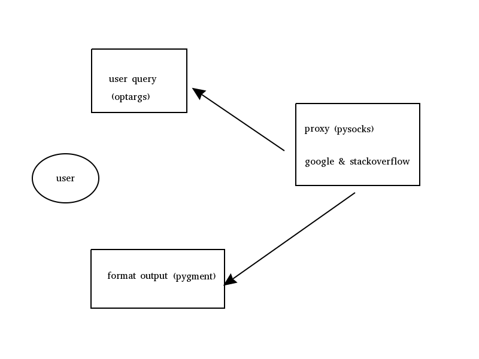
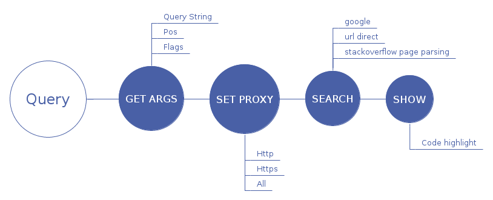

# 目录

1. 简介
2. 特点
3. 源码解析
    1. 系统结构
    2. 工作流
    3. 细节解析
4. 从中学到的

# 简介

[Howdoi](https://github.com/gleitz/howdoi) 是一个非常棒的python应用，他允许程序员使用命令行来搜索常见的一些命令，这些答案都来自stackoverflow上面star最多的答案，可以使用这个工具搜索些简单的问题，比如：

``` shell
➜ howdoi format date shell
DATE=`date +%Y-%m-%d`
```

上面的这个命令搜索如何在shell中格式化日期，当然除了搜索程序代码外你也可以用来搜索一些常见的问题，比如搜索git和svn各自的特点：

``` shell
➜ howdoi git vs svn
Git is not better than Subversion. But is also not
worse. It's different. The key difference is that it
is decentralized. Imagine you are a developer on the
road, you develop on your laptop and you want to have
source control so that you can go back 3 hours...
```
这个时候你可以打开google搜索：

``` shell
git vs svn site:www.stackoverflow.com
```

这两个答案是一样的，不过使用howdoi的话，你不必要打开浏览器，你只需要在命令行就可以完成答案的搜索，但是如果是成片的文字阅读的话，使用浏览器更好，段落分割做的好一些，在命令行上面阅读大片的文字很费力。

# 特点

+ 支持goolge和stackoverflow搜索
+ 支持系统全局http(s)代理
+ 支持代码高亮
+ 支持SSL
+ 支持Cache
+ 支持选择答案

具体的细节和功能，详见使用说明：

``` shell
usage: howdoi [-h] [-p POS] [-a] [-l] [-c] [-n NUM_ANSWERS] [-C] [-v]
              [QUERY [QUERY ...]]

instant coding answers via the command line

positional arguments:
  QUERY                 the question to answer

optional arguments:
  -h, --help            show this help message and exit
  -p POS, --pos POS     select answer in specified position (default: 1)
  -a, --all             display the full text of the answer
  -l, --link            display only the answer link
  -c, --color           enable colorized output
  -n NUM_ANSWERS, --num-answers NUM_ANSWERS
                        number of answers to return
  -C, --clear-cache     clear the cache
  -v, --version         displays the current version of howdoi

```

# 源码解析

从功能来看该程序主要使用代理并结合google来获取stackoverflow上面的star最多的答案，但是设计上面有众多细节可以学习，下面的是我列举的几点：

- 解析系统全局代理
- google高级搜索
- 网页抓取与跳转
- 代码高亮

## 系统结构

这个项目是一个单脚本的项目，其中作者的高明之处并不体现在结构设计上面，以下简单的将程序划分为三个部分，输入，输出，处理：



图中的箭头表示调用关系，程序的核心部分是通过google和stackoverflow搜索最佳的答案。

## 工作流

整个项目的工作流程如下：



各个阶段的主要执行过程在图中标注了出来，如果划分为不同的阶段，每个过程的处理细节也会有所不同，这只是其中一种方式，本文剩下的细节也会参照这四个阶段来解读。

## 细节解析

### 用户输入获取

使用`argparse`来解析用户命令行输入：

``` python
def get_parser():
    parser = argparse.ArgumentParser(description='instant coding answers via the command line')
    parser.add_argument('query', metavar='QUERY', type=str, nargs='*',
                        help='the question to answer')
    parser.add_argument('-p', '--pos', help='select answer in specified position (default: 1)', default=1, type=int)
    parser.add_argument('-a', '--all', help='display the full text of the answer',
                        action='store_true')
    parser.add_argument('-l', '--link', help='display only the answer link',
                        action='store_true')
    parser.add_argument('-c', '--color', help='enable colorized output',
                        action='store_true')
    parser.add_argument('-n', '--num-answers', help='number of answers to return', default=1, type=int)
    parser.add_argument('-C', '--clear-cache', help='clear the cache',
                        action='store_true')
    parser.add_argument('-v', '--version', help='displays the current version of howdoi',
                        action='store_true')
    return parser
```

这里只是简单的使用了python库来实现，没什么好说的，在添加新的`argument`的时候有两个比较特殊的参数值得注意：

- `metavar`: 用来显式的指定该命令行参数的别名，可以用来区分不同的参数及其含义
- `dest`: 用来指定当该参数从命令行解析出来后所存储的位置

在添加新的argument的时候可以通过nargs选项来指定该参数消耗多少命令行参数，具体的可以通过使用正则表达式中的*，+，?来指定消耗不定多个。

### HTTP代理

你从源代码仓库中下载下来的代码，并不能很好的开始工作，这个应用默认使用系统的http(s)代理，我们先来看看这部分的代码:

``` python
def get_proxies():
    proxies = getproxies()
    filtered_proxies = {}
    for key, value in proxies.items():
        if key.startswith('http'):
            if not value.startswith('http'):
                filtered_proxies[key] = 'http://%s' % value
            else:
                filtered_proxies[key] = value
    return filtered_proxies
```

从上面的代码可以看出程序会获取系统的代理信息，从中筛选出http(s)代理，所以在运行这个程序以前，注意检查系统变量中是否有http(s)代理的环境变量设置。

``` shell
env | grep http
```

没有的话需要自己设置，或者使用相应的软件代理。这里我们说一下怎么使用shadowsocks来配合howdoi进行使用：

首先你要配置你的shadowsocks并开启它，这里我们假设我们配置的本地代理端口为：8080， 地址为：127.0.0.1。

在fedora23上面，使用shadowsocks的Google插件会为你设置系统的全局代理：

``` shell
all_proxy=SOCKS5://127.0.0.1:8080
```

你可以通过`env`命令查询到这个代理的设置，如果没有帮助你生成的话，你可以自己添加。

但是从源代码中我们看到，这里并没有从全局的代理（all_proxy）中获取代理信息，仅仅是解析了http(s)_proxy，所以这个地方我们可以选择手动设置环境变量：

- http_proxy: socks5://127.0.0.1:8080
- https_proxy: socks5://127.0.0.1:8080

这样程序还是没法很好的运行，因为环境变量是以socks5开头的，所以软件会为我们添加`http://`的前缀，这样显然不对，我们可以改变源代码来做到这一点：

``` python

import re

def get_proxies():
    proxies = getproxies()
    filtered_proxies = {}
    for key, value in proxies.items():
        if key.startswith('http'):
            match = re.search(r'^\d{1,3}.', value)
            if match:
                filtered_proxies[key] = 'http://%s' % value
            else:
                filtered_proxies[key] = value
    return filtered_proxies
```

这里由于我们要处理没有前缀的代理和有前缀但是不是http的代理，所以我们直接查找该代理是否有前缀，没有前缀的话就默认添加http代理，有前缀的但不是http的我们就不做任何处理。

### 请求缓存

程序中对`http`的处理有：

- *搜索URL的优化*： 在Google高级搜索中我们介绍了
- *SSL的支持*： 这个主要依赖于`requests`库
- *Cache管理*

关于cache的管理这一块还是有点东西我们可以学习一下：

``` python
# 常见缓存文件及其文件夹
XDG_CACHE_DIR = os.environ.get('XDG_CACHE_HOME',
                               os.path.join(os.path.expanduser('~'), '.cache'))
CACHE_DIR = os.path.join(XDG_CACHE_DIR, 'howdoi')
CACHE_FILE = os.path.join(CACHE_DIR, 'cache{0}'.format(
    sys.version_info[0] if sys.version_info[0] == 3 else ''))

# 开启缓存
def _enable_cache():
    if not os.path.exists(CACHE_DIR):
        os.makedirs(CACHE_DIR)
    requests_cache.install_cache(CACHE_FILE)


# 清理缓存文件
def _clear_cache():
    for cache in glob.glob('{0}*'.format(CACHE_FILE)):
        os.remove(cache)

```

这里主要是关于缓存目录的管理问题需要学习一下，很多时候我们要在应用程序中添加缓存目录来当作临时存储区域，这个地方它的处理比较简单，涉及到单文件，并没有多次创建，创建之后调用`requests_cache`来安装缓存。

为了说明如何更好的管理缓存，我们看看七牛的设计思路（这个地方跑得有点远，我们就一起学习下）：

``` python
# -*- coding: utf-8 -*-

import base64
import json
import os
import tempfile


class UploadProgressRecorder(object):
    """持久化上传记录类
    该类默认保存每个文件的上传记录到文件系统中，用于断点续传
    上传记录为json格式：
    {
        "size": file_size,
        "offset": upload_offset,
        "modify_time": file_modify_time,
        "contexts": contexts
    }
    Attributes:
        record_folder: 保存上传记录的目录
    """
    def __init__(self, record_folder=tempfile.gettempdir()):
        self.record_folder = record_folder

    def get_upload_record(self, file_name, key):

        key = '{0}/{1}'.format(key, file_name)

        record_file_name = base64.b64encode(key.encode('utf-8')).decode('utf-8')
        upload_record_file_path = os.path.join(self.record_folder,
                                               record_file_name)
        if not os.path.isfile(upload_record_file_path):
            return None
        with open(upload_record_file_path, 'r') as f:
            json_data = json.load(f)
        return json_data

    def set_upload_record(self, file_name, key, data):
        key = '{0}/{1}'.format(key, file_name)
        record_file_name = base64.b64encode(key.encode('utf-8')).decode('utf-8')
        upload_record_file_path = os.path.join(self.record_folder,
                                               record_file_name)
        with open(upload_record_file_path, 'w') as f:
            json.dump(data, f)

    def delete_upload_record(self, file_name, key):
        key = '{0}/{1}'.format(key, file_name)
        record_file_name = base64.b64encode(key.encode('utf-8')).decode('utf-8')
        record_file_path = os.path.join(self.record_folder,
                                        record_file_name)
        os.remove(record_file_path)

```

这里有一点很重要，这个recoder对象内部使用了base64作为编码方案，b64是一种web安全编码，关于base64的东西也比较重要，但是我并不打算在这里展开了，详细的可以参见这篇[文章](https://pymotw.com/2/base64/)。七牛上传的过程中每个key是唯一的，所以当你在使用这个类来创建缓存文件的时候需要注意使用唯一的key值来创建。

### 核心搜索

根据用户的问题来搜索出让用户满意的简洁答案才是这个应用的实用的地方，前面我们说了这个应用使用Google高级搜索和stackoverflow结合来找到高star的答案。
 总体来说分两个部分：

 1. 通过Google在stackoverflow上找出最符合的帖子
 2. 通过pyquery从这个页面中找到我们想要的答案

 **1**. Google搜索找到最符合的页面

 Google能较好的‘理解’用户的问题，这一点相对于广告众多，搜索不准确的百度来说确实良心，使用Google可以通过网页被引用数，目标网站来优化搜索，这里来看看原作者的做法：

 ``` python

 SEARCH_URL = 'http://www.google.com/search?q=site:{0}%20{1}'
 URL = os.getenv('HOWDOI_URL') or 'stackoverflow.com'

 result = _get_result(SEARCH_URL.format(URL, url_quote(query)))

 ```

 他这里直接通过构造url来搜索指定的内容，从构造的结构来看，实质上他是直接指定了搜索的网站：'site:www.stackoverflow.com'或者用户自己通过`HOWDOI_URL`环境变量来指定的网站。

  搜索到结果后，然后从Google搜索列表中根据用户输入的`pos`(具体的可以看前面的用户命令行选项)来选择使用第几个作为答案页面来解析。

``` python

html = pq(result)
return [a.attrib['href'] for a in html('.l')] or \
        [a.attrib['href'] for a in html('.r')('a')]

# 从上面的返回中获取到links，从用户的输入中获取position
def get_link_at_pos(links, position):
    if not links:
        return False

    if len(links) >= position:
        link = links[position - 1]
    else:
        link = links[-1]
    return link

```

这样我们从众多的Google搜索结果中找到了用户满意的那个，默认是第一个。

**2**. 关于从页面中抓取相应的结果

stackoverflow的每个问题都有一个编号的，我们拿到link后，直接使用`urlopen`来获取到页面，解析相应的html页面就可以找到答案。

``` python

    first_answer = html('.answer').eq(0)
    instructions = first_answer.find('pre') or first_answer.find('code')
    args['tags'] = [t.text for t in html('.post-tag')]

    if not instructions and not args['all']:
        text = first_answer.find('.post-text').eq(0).text()
    elif args['all']:
        texts = []
        for html_tag in first_answer.items('.post-text > *'):
            current_text = html_tag.text()
            if current_text:
                if html_tag[0].tag in ['pre', 'code']:
                    texts.append(_format_output(current_text, args))
                else:
                    texts.append(current_text)
        texts.append('\n---\nAnswer from {0}'.format(link))
        text = '\n'.join(texts)
    else:
        text = _format_output(instructions.eq(0).text(), args)
    if text is None:
        text = NO_ANSWER_MSG
    text = text.strip()
    return text


```

从stackoverflow的网站html来看，被采纳的答案放在了`.post-text`中，这里优先选择了该答案作为结果，具体的怎么查找的需要大家自己学习pyquery，和jquery很类似，我用了一下，不需要太多的基础知识，只是要学习新的东西就看脑袋能不能放下了。

### 格式化输出

程序中使用了pygments来高亮代码，pygments中内置了很多语言的高亮lexer，这里由于随着用户搜索的变动，可能出现各种各样的语言，所以这里使用stackoverflow的tag来获取lexer, 如果从tag中并没有获得lexer，则会通过`guess_lexer`方法来获取lexer。

``` python
def _format_output(code, args):
    if not args['color']:
        return code
    lexer = None

    # try to find a lexer using the StackOverflow tags
    # or the query arguments
    for keyword in args['query'].split() + args['tags']:
        try:
            lexer = get_lexer_by_name(keyword)
            break
        except ClassNotFound:
            pass

    # no lexer found above, use the guesser
    if not lexer:
        try:
            lexer = guess_lexer(code)
        except ClassNotFound:
            return code

    return highlight(code,
                     lexer,
                     TerminalFormatter(bg='dark'))
```


# 从中学到的

这篇作为我的第一个源码解析帖子，我自己也学习了不少：

- 构造url quote
- 安装管理http请求缓存
- 从stackoverflow页面中获取用户采纳的答案
- shadowsocks和howdoi联合配置的问题

由于howdoi这个应用本身也不是很大，可能由于时间的问题，我不可能从头到脚的都细说一遍，知识把该有的流程走了一遍，重点学习了一些我感觉有用的细节，有什么问题大家在学习的过程中慢慢补充。